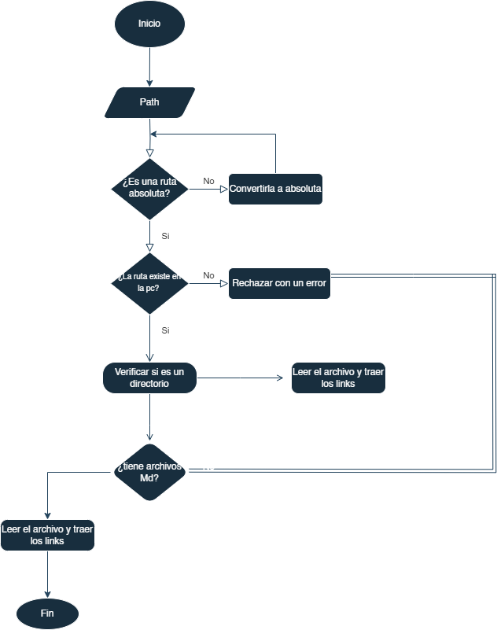

# Markdown Links

## Índice

- [1. Preámbulo](#1-preámbulo)
- [2. Resumen del proyecto](#2-resumen-del-proyecto)
- [3. Objetivos de aprendizaje](#3-objetivos-de-aprendizaje)
- [4. Diagrama de Flujo](#4-diagrama-de-flujo)
- [5. Autora](#5-autora)
---

## 1. Preámbulo

Un archivo Markdown es un tipo de archivo de texto plano que utiliza un formato de marcado ligero para dar
formato a documentos de manera sencilla y legible por humanos. Fue creado por John Gruber en 2004 como una
forma de escribir contenido en línea de manera rápida y fácil, sin la complejidad de lenguajes de marcado 
más avanzados como HTML.

En un archivo Markdown, puedes utilizar una serie de símbolos y convenciones de formato simples para 
estructurar tu texto, agregar encabezados, crear listas, insertar enlaces, imágenes y mucho más.

## 2. Resumen del proyecto

En este proyecto se ha iniciado el desarrollo de una librería en Node.js, cuya función es analizar los links dentro de estos archivos.

## 3. Objetivos de aprendizaje

### JavaScript

- [ ] **Diferenciar entre tipos de datos primitivos y no primitivos**

- [ ] **Arrays (arreglos)**

- [ ] **Objetos (key, value)**

- [ ] **Uso de condicionales (if-else, switch, operador ternario, lógica booleana)**

- [ ] **Funciones (params, args, return)**

- [ ] **Módulos de CommonJS**

- [ ] **Diferenciar entre expresiones (expressions) y sentencias (statements)**

- [ ] **Callbacks**

- [ ] **Promesas**

- [ ] **Pruebas unitarias (unit tests)**

- [ ] **Pruebas asíncronas**

- [ ] **Uso de mocks y espías**

- [ ] **Pruebas de compatibilidad en múltiples entornos de ejecución**

- [ ] **Uso de linter (ESLINT)**

- [ ] **Uso de identificadores descriptivos (Nomenclatura y Semántica)**

### Node.js

- [ ] **Instalar y usar módulos con npm**

- [ ] **File system (fs, path)**

### Control de Versiones (Git y GitHub)

- [ ] **Git: Instalación y configuración**

- [ ] **Git: Control de versiones con git (init, clone, add, commit, status, push, pull, remote)**

- [ ] **Git: Integración de cambios entre ramas (branch, checkout, fetch, merge, reset, rebase, tag)**

- [ ] **GitHub: Creación de cuenta y repos, configuración de llaves SSH**

- [ ] **GitHub: Colaboración en Github (branches | forks | pull requests | code review | tags)**

- [ ] **GitHub: Organización en Github (projects | issues | labels | milestones | releases)**

### HTTP

- [ ] **Consulta o petición (request) y respuesta (response).**

- [ ] **Códigos de status de HTTP**

## 4. Diagrama de Flujo

## 5. Autora

- [@raudelgado 🌸✨](https://github.com/raudelgado)
